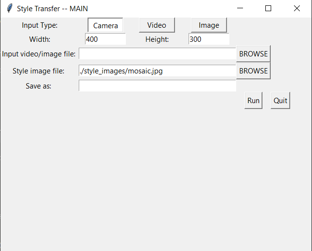

# RealTime-Neural-Style-Transfer-with-TF-Hub

The repo creates a simple Tkinter GUI for Neural style transfer task. The core of the code is by
using this [Tensorflow Hub Model](https://tfhub.dev/google/magenta/arbitrary-image-stylization-v1-256/2). The repo
only does forward prediction and there is no script for training or finetuning. For the latter, you will find tons of 
good resources online such as [here](https://www.tensorflow.org/tutorials/generative/style_transfer) or [here](https://keras.io/examples/generative/neural_style_transfer/).

The model can create stylized images/videos from your webcam, saved video or images. Though the code can run with a cpu, it is recommended 
that you run with a GPU, especially for the realtime rendering with webcam input. You may also use virtual camera tools to feed the rendered 
video from your webcam to your online meeting. For setups of these virtual camera tools on different platform, please refer to the relevant
steps on this cool project: [Avatarify](https://github.com/alievk/avatarify).

## Usage
   

* Select the source of video/image for the input by the radio button at top.    
* Specify the desire size for the output.    
* For saved radios of images, type in the path of input files.    
* Type in the path to your style image to use.    
* If you want to save the rendered result, also type in the file name you want to save.    

Some sample style images are included in `./style_images`. If you want to use some other styles, just 
delete the default path and then specify the path to the image whose style you would like to transfer in the GUI entry.
In a terminal, run `python NST_GUI.py` to launch the GUI.  

## Image examples

   

## Web cam examples
Video examples here are done with cpu, so fps is low. A GPU will help get a true real time result.  

  

Feel free to expand and develop upon this repo and have fun.
